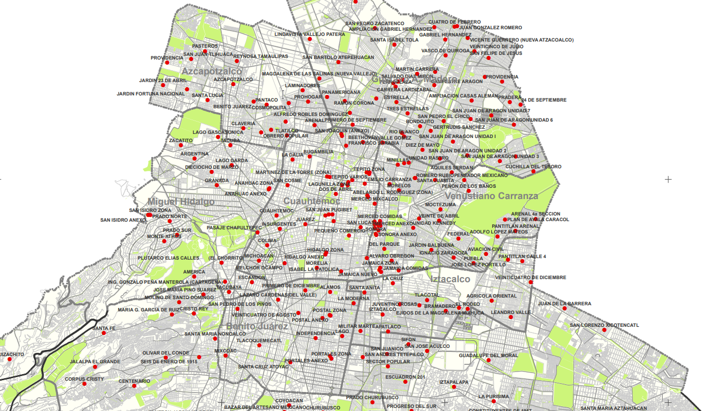

# Curso de Matemáticas Discretas y Algoritmos (madi2022-1) IIMAS-UNAM 
Repositorio de notas, practicas, tareas y proyectos del curso de Matemáticas Discretas, impartido en la [Licenciatura en Ciencia de Datos](https://cienciadatos.iimas.unam.mx/) en el [IIMAS](https://www.iimas.unam.mx/).

## [Prácticas](Practicas/)
- **[Unidad 1: Inducción, recursión e introducción a teoría de gráficas](https://github.com/gandres-dev/Matematicas-discretas-y-algoritmos/tree/main/Practicas/Unidad_1)**
    - [Práctica 1 Inducción](https://nbviewer.org/github/gandres-dev/Matematicas-discretas-y-algoritmos/blob/main/Practicas/Unidad_1/practica1/1_Induccion.ipynb)
    - [Práctica 2 Recursión](https://nbviewer.org/github/gandres-dev/Matematicas-discretas-y-algoritmos/blob/main/Practicas/Unidad_1/practica2/2_Recursion.ipynb)
    - [Práctica 3 Gráficas en Python](https://nbviewer.org/github/gandres-dev/Matematicas-discretas-y-algoritmos/blob/main/Practicas/Unidad_1/practica4/3_Graficas_en_python.ipynb)
    - [Práctica 4 Primeros algoritmos en gráficas](https://nbviewer.org/github/gandres-dev/Matematicas-discretas-y-algoritmos/blob/main/Practicas/Unidad_1/practica4/4_Primeros_algoritmos_en_graficas.ipynb)
    - [Práctica 5 Sobre caminos y ciclos](https://nbviewer.org/github/gandres-dev/Matematicas-discretas-y-algoritmos/blob/main/Practicas/Unidad_1/practica5/Copia_de_Sobre_caminos_y_ciclos.ipynb)
    - [Práctica 6 NetworkX para gráficas planares y dirigidas](https://nbviewer.org/github/gandres-dev/Matematicas-discretas-y-algoritmos/blob/main/Practicas/Unidad_1/practica6/6_NetworkX_para_graficas_planares_y_digraficas.ipynb)
- **[Unidad 2: Análisis de algoritmos](https://github.com/gandres-dev/Matematicas-discretas-y-algoritmos/tree/main/Practicas/Unidad_2)**
    - [Práctica 1 Correctitud en Algoritmos](https://nbviewer.org/github/gandres-dev/Matematicas-discretas-y-algoritmos/blob/main/Practicas/Unidad_2/practica1/1_Correctitud_de_algoritmos.ipynb)
    - [Práctica 2 Analizando complejidad en algoritmos](https://nbviewer.org/github/gandres-dev/Matematicas-discretas-y-algoritmos/blob/main/Practicas/Unidad_2/2_Analizando_Complejidad_en_Algoritmos.ipynb)
    - [Práctica 3 Programación orientada a objetos](https://nbviewer.org/github/gandres-dev/Matematicas-discretas-y-algoritmos/blob/main/Practicas/Unidad_2/practica4/3_Programacion_orientada_a_objetos.ipynb)
    - [Práctica 4 Árboles binarios de búsqueda](https://nbviewer.org/github/gandres-dev/Matematicas-discretas-y-algoritmos/blob/main/Practicas/Unidad_2/practica4/4_Arboles_binarios_de_busqueda.ipynb )
    - [Práctica 5 Árboles autobalanceables](https://nbviewer.org/github/gandres-dev/Matematicas-discretas-y-algoritmos/blob/main/Practicas/Unidad_2/practica5/5_Arboles_autobalanceables.ipynb)
    - [Práctica 6 Algoritmos de ordenamiento](https://nbviewer.org/github/gandres-dev/Matematicas-discretas-y-algoritmos/blob/main/Practicas/Unidad_2/practica6/6_Algoritmos_de_Ordenamiento.ipynb)
- **[Unidad 3: Tipos de algoritmos](https://github.com/gandres-dev/Matematicas-discretas-y-algoritmos/tree/main/Practicas/Unidad_3)**
    - [Práctica 1 Algoritmos voraces](https://nbviewer.org/github/gandres-dev/Matematicas-discretas-y-algoritmos/blob/main/Practicas/Unidad_3/practica1/1_Algoritmos_voraces.ipynb)
    - [Práctica 2 Divide y vencerás con estructuras de datos](https://nbviewer.org/github/gandres-dev/Matematicas-discretas-y-algoritmos/blob/main/Practicas/Unidad_3/2_Divide_y_venceras_con_estructuras_de_datos.ipynb)
    - [Práctica 3 Búsqueda binaria y más allá](https://nbviewer.org/github/gandres-dev/Matematicas-discretas-y-algoritmos/blob/main/Practicas/Unidad_3/practica4/3_Busqueda_binaria_y_mas_alla.ipynb)
    - [Práctica 4 Backtracking](https://nbviewer.org/github/gandres-dev/Matematicas-discretas-y-algoritmos/blob/main/Practicas/Unidad_3/practica4/4_Backtracking.ipynb)
    - [Práctica 5 Memoización](https://nbviewer.org/github/gandres-dev/Matematicas-discretas-y-algoritmos/blob/main/Practicas/Unidad_3/practica5/5_Memoizacion.ipynb)
- **[Unidad 4: Más algoritmos en teoría de gráficas](https://github.com/gandres-dev/Matematicas-discretas-y-algoritmos/tree/main/Practicas/Unidad_4)**
    - [Práctica 1 Ordenamiento topológico](https://nbviewer.org/github/gandres-dev/Matematicas-discretas-y-algoritmos/blob/main/Practicas/Unidad_4/practica1/01_Ordenamiento_topologico.ipynb) 
    - [Extra: Scraping](https://nbviewer.org/github/gandres-dev/Matematicas-discretas-y-algoritmos/blob/main/Practicas/Extra/01_Scraping.ipynb) 
<!-- -  -->

---

## [Proyecto (Mercados mexicanos)](https://nbviewer.org/github/gandres-dev/Matematicas-discretas-y-algoritmos/blob/main/Proyecto/notebook/Proyecto_MercadosCDMX.ipynb)

Una de las cosas que nos han caracterizado a México son sus mercados tradicionales, podemos
encontrar pasillo repletos de frutas, verduras, flores, carnes, lácteos, abarrotes y dulces de muchos
sabores en los diferentes mercados de la Ciudad de México. Hemos observado que los diversos mercados
registrados en el gobierno de la ciudad tienen una antigüedad que abarca desde 1957 hasta nuestro
dı́as, por eso hemos decidido a promover y dar conocer a todos los turista que visiten la Ciudad de
México a pasar por cada uno de ellos sin pasar dos veces en el mismo para disfrutar de la extensa y variedad de artesanı́as, comidas, dulces mexicanos entre muchas cosas más.

Good Reference about Traveling Salesman Problem: https://youtu.be/GiDsjIBOVoA

---
## Profesor
[Leonardo Ignacio Martinez Sandoval](https://github.com/leomtz)

Ayudante: [Rodolfo Figueroa](https://github.com/RodolfoFigueroa)

---

## Recursos electrónicos
1. Notas del Curso.[Liga](http://madi.nekomath.com/intro.html)
2. Blog MADI. [Liga](https://blog.nekomath.com/madi/)
3. Practicas MADI.[Liga](https://github.com/RodolfoFigueroa/madi2022-1)
4. Classes and Teaching by Erik Demaine. [Liga](https://erikdemaine.org/classes/)
5. Mas notas sobre Data Structures and Algorithms [Liga](https://btholt.github.io/complete-intro-to-computer-science/)

---
## Bibliografía
__Texto principal__

1. Steven S. Skiena. The Algorithm Design Manual. 
Springer

__Textos auxiliares__

2. María Luisa Pérez Seguí. Combinatoria Avanzada. Serie cuadernos de la Olimpiada de Matemáticas
1. María Luisa Pérez Seguí. Combinatoria. Serie cuadernos de la Olimpiada de Matemáticas
1. Loren C. Larson. Problem-Solving through Problems. Springer Verlag
1. Gayle L. McDowell. Cracking the coding interview
T. Cormen et al. Introduction to algorithms

